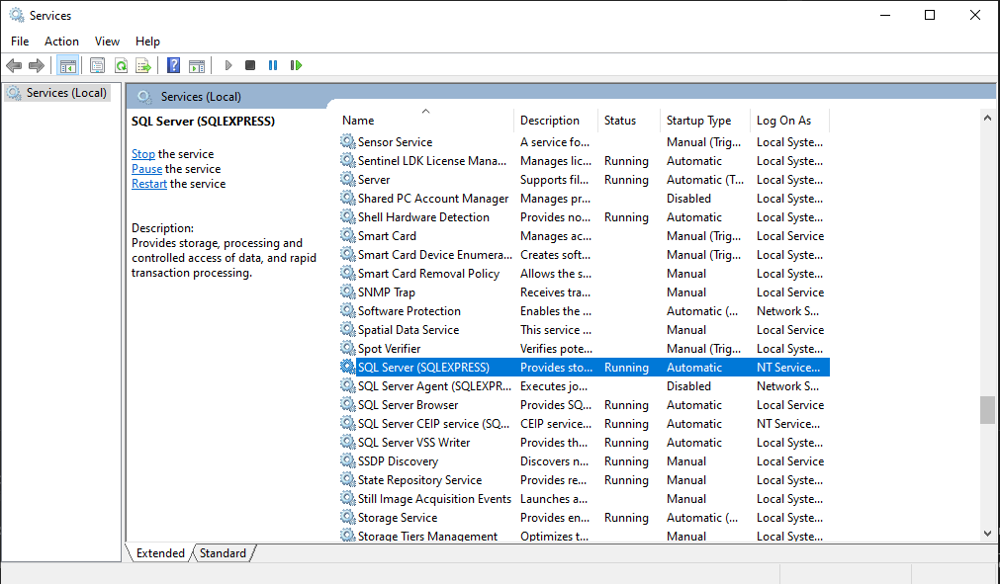
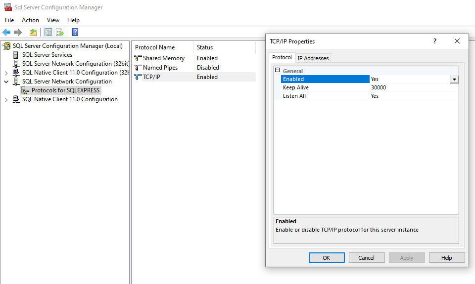
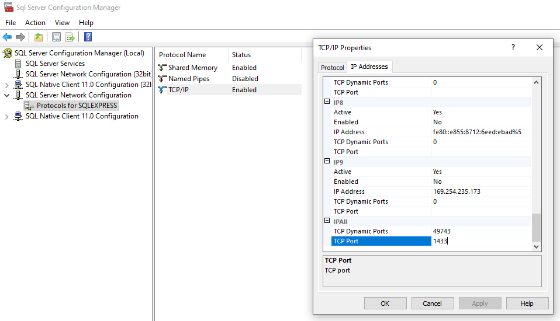
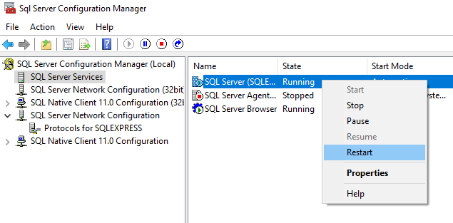

# TravelHunt

## Database setup

1. Install 
[Microsoft SQL Server](https://www.microsoft.com/en-us/sql-server/sql-server-downloads "Microsoft SQL Server") 
and [SQL Management Studio](https://docs.microsoft.com/en-us/sql/ssms/download-sql-server-management-studio-ssms?view=sql-server-ver15 "SSMS")
2. Make sure your SQLServer proccess is up and running



3. Open SSMS and login with Windows Authentication

4. Run this screate to create an user
```SQL
CREATE LOGIN [user] WITH PASSWORD=N'user', DEFAULT_DATABASE=[master], DEFAULT_LANGUAGE=[us_english], CHECK_EXPIRATION=OFF, CHECK_POLICY=OFF
GO

GO

ALTER SERVER ROLE [sysadmin] ADD MEMBER [user]
GO

ALTER SERVER ROLE [securityadmin] ADD MEMBER [user]
GO

ALTER SERVER ROLE [serveradmin] ADD MEMBER [user]
GO

ALTER SERVER ROLE [setupadmin] ADD MEMBER [user]
GO

ALTER SERVER ROLE [processadmin] ADD MEMBER [user]
GO

ALTER SERVER ROLE [diskadmin] ADD MEMBER [user]
GO

ALTER SERVER ROLE [dbcreator] ADD MEMBER [user]
GO

ALTER SERVER ROLE [bulkadmin] ADD MEMBER [user]
GO

CREATE DATABASE flashscore
GO

USE flashscore
GO

CREATE TABLE example(
    id int
)
GO

INSERT INTO example values (1),(2)
```

5. Open SQL Server Configuration Manager

6. Enable TCP/IP



7. Go to IP Addresses and complete the port with 1433 as shown



8. Restart the service



9. Step 2 from this https://www.dundas.com/support/learning/documentation/installation/how-to-enable-sql-server-authentication